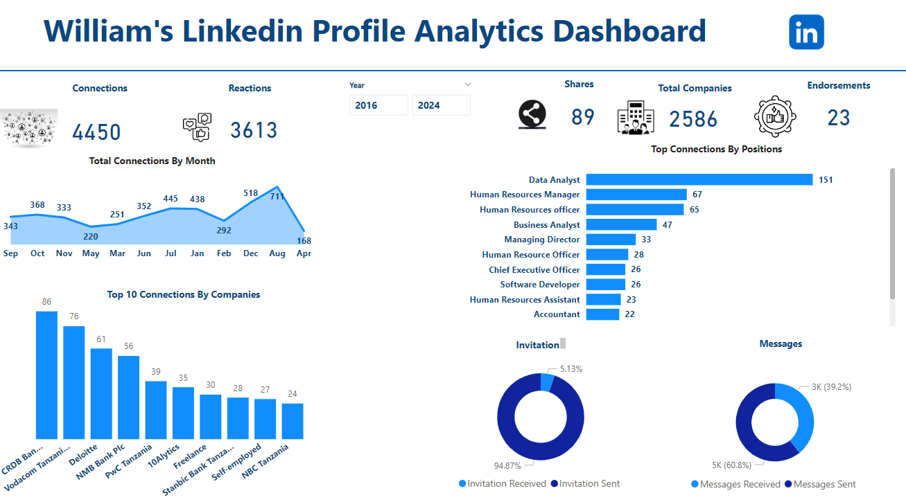

# 📊 LinkedIn Engagement Analytics Dashboard

## Project Overview
This project analyzes LinkedIn page performance data to understand audience engagement, content performance, and connections growth.

The goal of the project was to transform raw LinkedIn analytics data into an interactive dashboard that helps track key engagement metrics and identify patterns in audience behavior.

The dashboard was developed using Power BI after cleaning and preparing the dataset in Excel.

---

## Dataset
The dataset contains LinkedIn page analytics including:

- Post impressions
- Clicks
- Reactions
- Comments
- Shares
- Engagement rate
- Follower growth
- Post dates

The data was exported from LinkedIn analytics and prepared for analysis.

---

## Tools Used
- Excel – data cleaning and preprocessing  
- Power BI – dashboard development and visualization

---

## What I Worked On
- Cleaned and structured LinkedIn analytics data
- Organized metrics into meaningful engagement categories
- Created calculated metrics to evaluate content performance
- Built an interactive dashboard to visualize audience engagement trends

---

## Dashboard Visualizations
The dashboard includes several visual components:

- **Line chart** – engagement trends over time  
- **Bar chart** – top performing posts  
- **connection growth chart** – audience growth patterns  
- **Engagement metrics cards** – total impressions, clicks, and engagement rate

---

## Key Insights
The dashboard helps answer important social media analytics questions such as:

- Which posts generate the most engagement
- How audience interaction changes over time
- Trends in impressions and clicks
- Growth patterns in connections

---
## Dashboard Preview

---

## Project Outcome
This project demonstrates how social media analytics data can be transformed into actionable insights using Power BI. It highlights the value of data visualization in understanding audience engagement and content performance.
